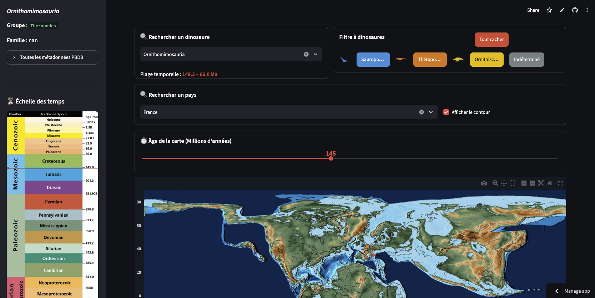

## A simple tool for dinosaurs 🦖

This app let you visualize the official non-avian dinosaur database (from PBDB) on actual paleogeographic recontructions throught time !  
A simplified PBDB ! Access it here -> https://paleoapp.streamlit.app/

  

## References and Acknowledgments

- **Paleogeographic reconstructions**: Scotese, C. R., & Wright, N. (2018). PALEOMAP paleodigital elevation models (PaleoDEMS) for the Phanerozoic. *Paleomap Proj*, 1, 26.
- **Dinosaur occurrences dataset**: The non-avian dinosaur database is sourced from the [PBDB](https://paleobiodb.org/classic) (accessed October 5, 2026).
- **Chronostratigraphic scale**: Karlstrom, K. E. (2021). Telling time at Grand Canyon National Park: 2020 update. *US Department of the Interior, National Park Service, Natural Resource Stewardship and Science*. Modified from Cohen, K. M., Finney, S. C., Gibbard, P. L., & Fan, J. X. (2013). The ICS international chronostratigraphic chart. *Episodes Journal of International Geoscience*, 36(3), 199-204.
- **Dinosaur silhouettes**: S. Hartman
- **Funding**: DIM PAMIR as part of the EcoCLimat project (R. Pintore et al.)

  

